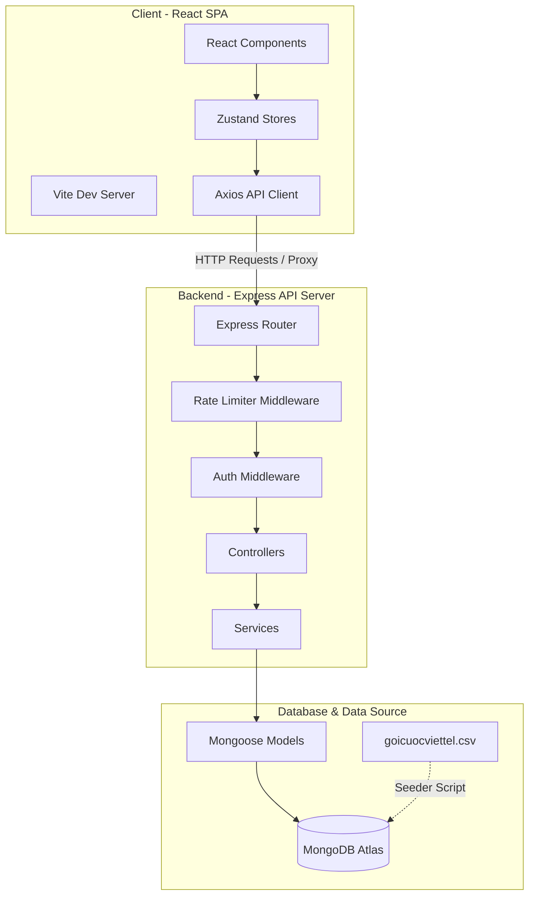
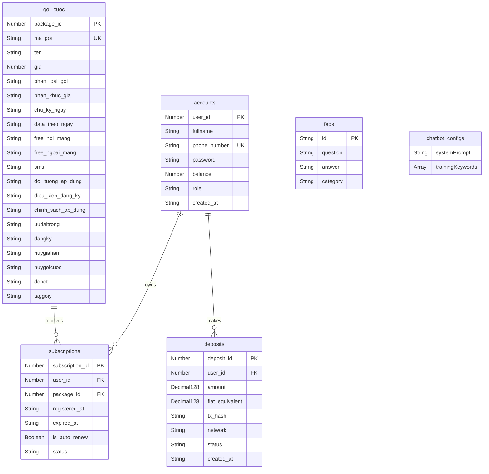

# Hệ thống Quản lý và Tra cứu Gói cước Viettel (Viettel Mobile Package Management)

Chào mừng bạn đến với tài liệu hướng dẫn kỹ thuật của **Viettel Mobile Package Management**. Đây là cổng tra cứu, so sánh, khảo sát và đăng ký gói cước di động Viettel, tích hợp chatbot trợ lý ảo thông minh và trang quản trị hệ thống (Admin Dashboard). Dự án được triển khai dưới mô hình Monorepo.

---

## Mục lục (Table of Contents)
1. [Project Overview](#project-overview)
2. [Tech Stack](#tech-stack)
3. [Project Structure](#project-structure)
4. [Installation](#installation)
5. [Environment Variables](#environment-variables)
6. [Configuration](#configuration)
7. [Database Architecture](#database-architecture)
8. [Features](#features)
9. [API Documentation](#api-documentation)
10. [Folder Description](#folder-description)
11. [Build & Deployment](#build--deployment)
12. [Scripts](#scripts)
13. [Dependencies](#dependencies)
14. [Security](#security)
15. [Known Limitations](#known-limitations)

---

## Project Overview

### Mục đích của hệ thống
Hệ thống được phát triển nhằm mục đích cung cấp một giải pháp hiện đại giúp người dùng dễ dàng tìm kiếm, lọc, so sánh và đăng ký các gói cước di động của nhà mạng Viettel. Hệ thống tích hợp một chatbot AI dựa trên từ khóa huấn luyện để giải đáp thắc mắc của khách hàng, cùng hệ thống ví ảo (Virtual Wallet) cho phép người dùng nạp tiền và đăng ký gói cước trực tiếp. Bên cạnh đó, hệ thống cũng cung cấp giao diện quản trị dành cho Admin để theo dõi thống kê doanh thu, quản lý danh sách người dùng, cập nhật gói cước, chỉnh sửa FAQs và cấu hình phản hồi của chatbot.

### Kiến trúc tổng quan
Dự án được xây dựng dưới dạng **Monorepo** gồm 2 phần chính:
* **Frontend (client)**: Ứng dụng Single Page Application (SPA) xây dựng trên nền tảng React và TypeScript, quản lý State tập trung bằng Zustand, sử dụng TailwindCSS v4 cho giao diện.
* **Backend (server)**: API Server viết bằng Node.js và Express, kết nối tới cơ sở dữ liệu MongoDB Atlas thông qua Mongoose.



---

## Tech Stack

| Thành phần | Công nghệ sử dụng |
| :--- | :--- |
| **Backend Core** | Node.js, Express (v5.2.1) |
| **Frontend Core** | React (v19.2.7), TypeScript, Vite (v8.1.0) |
| **Styling** | TailwindCSS v4 (sử dụng `@tailwindcss/vite`) |
| **State Management** | Zustand (v5.0.14) |
| **HTTP Client** | Axios (v1.18.1) |
| **Database** | MongoDB Atlas, Mongoose (v9.7.3) |
| **Authentication** | Custom JWT (HMAC-SHA256), Bearer Token |
| **Password Hashing**| Scrypt (`crypto.scryptSync`) |
| **Form Handling** | React Hook Form (v7.80.0), Zod (v4.4.3) |
| **Animations / Icons**| Framer Motion (v12.42.0), Lucide React |
| **CSV Parser** | csv-parser (v3.2.1) |
| **Cache** | *Không xác định được từ source code* (Không sử dụng) |
| **Queue** | *Không xác định được từ source code* (Không sử dụng) |
| **Storage** | Lưu trữ tệp tin CSV cục bộ để nạp dữ liệu. Không sử dụng dịch vụ lưu trữ đám mây. |
| **Third-party Services**| Không sử dụng dịch vụ bên ngoài (Ngoại trừ mô phỏng giao dịch crypto qua mạng lưới BSC, ETH, TRON và VietQR nội bộ). |

---

## Project Structure

Dưới đây là sơ đồ thư mục chính của dự án monorepo:

```
viettel/
├── client/                 # Mã nguồn Frontend (React)
│   ├── public/             # Thư mục chứa tài nguyên tĩnh
│   ├── src/                # Thư mục code chính của React
│   │   ├── assets/         # Tài nguyên hình ảnh, logo
│   │   ├── components/     # Các UI Components tái sử dụng
│   │   ├── layouts/        # Bố cục giao diện (Client, Auth, Admin)
│   │   ├── pages/          # Các trang chính của hệ thống
│   │   ├── services/       # Định nghĩa API Client (Axios)
│   │   ├── store/          # Zustand State Management
│   │   ├── types/          # Định nghĩa TypeScript Types & Interfaces
│   │   └── utils/          # Hàm tiện ích chung
│   ├── package.json        # Cấu hình dependencies Frontend
│   └── vite.config.ts      # Cấu hình Vite & Proxy
├── server/                 # Mã nguồn Backend (Express)
│   ├── src/
│   │   ├── controllers/    # Xử lý Logic yêu cầu API
│   │   ├── middlewares/    # Các bộ lọc trung gian (Auth, Rate limit, Error)
│   │   ├── models/         # Mongoose Schemas & Models
│   │   ├── routes/         # Định nghĩa các Endpoints API
│   │   ├── services/       # Tầng nghiệp vụ xử lý dữ liệu với Database
│   │   ├── parse_csv.js    # Tiện ích đọc thử file dữ liệu CSV
│   │   ├── seed.js         # Script đồng bộ dữ liệu gói cước từ CSV vào MongoDB
│   │   ├── seed_extra.js   # Script tạo tài khoản mẫu, lịch sử nạp tiền và đăng ký
│   │   └── index.js        # Entry point khởi chạy Express API Server
│   └── package.json        # Cấu hình dependencies Backend
├── package.json            # Cấu hình workspace monorepo
└── README.md               # Tài liệu hướng dẫn dự án
```

---

## Installation

Để cài đặt và khởi chạy dự án trên môi trường phát triển cục bộ (Local Development), hãy thực hiện các bước sau:

### Bước 1: Clone dự án và cài đặt dependencies ở thư mục gốc
Từ thư mục gốc của monorepo, chạy lệnh sau để tự động cài đặt toàn bộ dependencies cho cả client và server:
```bash
npm install
```

### Bước 2: Khai báo biến môi trường cho Backend
Tạo file `.env` bên trong thư mục `server/` và cấu hình các thông số kết nối:
```env
MONGODB_URI=mongodb+srv://<username>:<password>@cluster0.e02x0sj.mongodb.net/goicuocviettel?retryWrites=true&w=majority
PORT=5000
JWT_SECRET=viettel_default_secret_key_123
```

### Bước 3: Nạp dữ liệu cơ sở dữ liệu (Database Seeding)
Đảm bảo bạn có file dữ liệu nguồn CSV tại đường dẫn `d:\webviettel\goicuocviettel.csv` (được bảo vệ). 

1. **Đồng bộ gói cước từ CSV**:
   Di chuyển vào thư mục `server` và chạy script để nạp danh sách gói cước vào DB (chỉ nạp các bản ghi chưa tồn tại, không ghi đè dữ liệu cũ):
   ```bash
   cd server
   node src/seed.js
   ```

2. **Khởi tạo dữ liệu người dùng mẫu & giao dịch**:
   Chạy script sau để làm sạch các bộ sưu tập cũ và tạo tài khoản thử nghiệm (2 người dùng, 1 admin), 15 lịch sử nạp tiền và 15 lịch sử đăng ký gói cước:
   ```bash
   node src/seed_extra.js
   ```
   *Danh sách tài khoản mẫu sau khi chạy seed:*
   * **Tài khoản Admin**: SĐT `0900000001` - Mật khẩu: `admin123`
   * **Tài khoản User 1**: SĐT `0987654321` - Mật khẩu: `password123` (Số dư ban đầu: 150,000đ)
   * **Tài khoản User 2**: SĐT `0912345678` - Mật khẩu: `password123` (Số dư ban đầu: 500,000đ)

### Bước 4: Khởi chạy dự án
* **Khởi chạy Backend API Server**:
  ```bash
  cd server
  npm start
  ```
  API Server sẽ khởi chạy tại: `http://localhost:5000`.

* **Khởi chạy Frontend React Client**:
  ```bash
  cd client
  npm run dev
  ```
  Ứng dụng web client sẽ hoạt động tại địa chỉ: `http://localhost:5173`. Các truy vấn API bắt đầu bằng `/api/*` sẽ được tự động chuyển hướng qua proxy về cổng 5000.

---

## Environment Variables

### Backend (`server/.env`)
* `MONGODB_URI` / `MONGO_URI`: Đường dẫn kết nối đến cơ sở dữ liệu MongoDB Atlas.
* `PORT`: Cổng chạy ứng dụng Express Backend (mặc định: `5000`).
* `JWT_SECRET`: Chuỗi khóa bí mật dùng để mã hóa và xác minh chữ ký mã token JWT (HMAC-SHA256).

### Frontend (`client/.env`)
* `VITE_API_URL`: URL cơ sở của API Server (mặc định là `http://localhost:5000`, nếu không khai báo sẽ tự động sử dụng giá trị này).

---

## Configuration

* **Server HTTP**: Express Server cấu hình các tiêu đề bảo mật tương đương Helmet giúp chống Clickjacking và MIME-sniffing:
  * `X-Frame-Options: DENY`
  * `X-Content-Type-Options: nosniff`
  * `Referrer-Policy: strict-origin-when-cross-origin`
  * `Strict-Transport-Security: max-age=31536000; includeSubDomains`
* **API Rate Limiter**: Cơ chế bảo vệ chống spam API được kích hoạt cho mọi tuyến đường `/api/` với giới hạn tối đa **120 requests/phút** trên mỗi địa chỉ IP. Trả về mã lỗi HTTP 429 nếu vượt ngưỡng.
* **CORS**: Cho phép truy cập từ mọi nguồn (`origin: '*'`), hỗ trợ các phương thức `GET, POST, PUT, DELETE, OPTIONS` và headers `Content-Type, Authorization`.
* **Database Connection**: Mongoose kết nối trực tiếp đến cơ sở dữ liệu đích `goicuocviettel`.
* **Cache & Queue**: *Không có cấu hình nào trong source code hiện tại.*
* **Mail & Storage**: Hệ thống chưa tích hợp cấu hình gửi mail hay các dịch vụ lưu trữ đám mây. Các file CSV được đọc trực tiếp từ ổ đĩa máy chủ.
* **Logging**: Cung cấp middleware ghi nhận lịch sử mọi yêu cầu HTTP đến console theo định dạng: `[ISO-TIMESTAMP] METHOD URL`.

---

## Database Architecture

Hệ thống sử dụng cơ sở dữ liệu MongoDB. Mongoose Models ánh xạ cấu hình các Collection như sau:

### Sơ đồ Database ERD (Mermaid)



### Danh sách và mô tả chi tiết các bảng (Collections)

#### 1. Collection `accounts`
Lưu trữ thông tin chi tiết về tài khoản của khách hàng và quản trị viên.

| Tên trường | Kiểu dữ liệu | Ràng buộc | Mô tả |
| :--- | :--- | :--- | :--- |
| `user_id` | `Number` | Required, Unique | Định danh số nguyên tăng dần của người dùng |
| `fullname` | `String` | Required | Họ và tên đầy đủ |
| `phone_number`| `String` | Required, Unique, Indexed | Số điện thoại đăng nhập hệ thống |
| `password` | `String` | Required | Mật khẩu đã được băm qua Scrypt |
| `balance` | `Number` | Default: `0` | Số dư tài khoản ảo (VND) |
| `role` | `String` | Enum: `['user', 'admin']`, Default: `user` | Quyền truy cập hệ thống |
| `created_at` | `String` | Default: ISO String | Thời gian đăng ký tài khoản |

#### 2. Collection `goi_cuoc` (Package Model)
Lưu trữ thông tin chi tiết của các gói cước Viettel, đồng bộ trực tiếp với file dữ liệu CSV nguồn.

| Tên trường | Kiểu dữ liệu | Ràng buộc | Mô tả |
| :--- | :--- | :--- | :--- |
| `package_id` | `Number` | Required, Unique, Alias: `id` | Mã số thứ tự gói cước |
| `ma_goi` | `String` | Required, Indexed | Mã viết tắt của gói cước (VD: SD90, MXH120) |
| `ten` | `String` | Required | Tên hiển thị đầy đủ của gói cước |
| `dohot` | `String` | Default: `'normal'` | Trạng thái ưu tiên nổi bật (`Hot` hoặc `normal`) |
| `phan_loai_goi`| `String` | Default: `'Data'` | Phân loại thể loại gói (`Data` / `Combo` / `Social` / `Thoại`) |
| `gia` | `Number` | Required | Giá cước đăng ký (VND) |
| `phan_khuc_gia`| `String` | Default: `'Trung_binh'` | Phân khúc giá cước (`Gia_re` / `Trung_binh` / `Cao_cap`) |
| `data_theo_ngay`| `String`| Default: `''` | Dung lượng mạng di động giới hạn theo ngày |
| `free_noi_mang`| `String` | Default: `'0'` | Số phút gọi nội mạng miễn phí |
| `free_ngoai_mang`| `String`| Default: `'0'` | Số phút gọi ngoại mạng miễn phí |
| `sms` | `String` | Default: `'0'` | Tin nhắn miễn phí đi kèm |
| `doi_tuong_ap_dung`| `String`| Default: `''` | Điều kiện sim được đăng ký gói cước |
| `uudaitrong` | `String` | Default: `''` | Mô tả ưu đãi bên trong gói cước |
| `chu_ky_ngay` | `String` | Default: `'30'` | Số ngày sử dụng của một vòng chu kỳ |
| `dangky` | `String` | Default: `''` | Cú pháp nhắn tin SMS đăng ký gói cước |
| `huygiahan` | `String` | Default: `''` | Cú pháp soạn tin nhắn hủy tự động gia hạn |
| `huygoicuoc` | `String` | Default: `''` | Cú pháp soạn tin nhắn hủy hoàn toàn gói cước |
| `taggoiy` | `String` | Optional | Các nhãn từ khóa gợi ý ngăn cách bằng dấu phẩy |
| `loai` | `String` | Optional | Công nghệ mạng hỗ trợ (ví dụ: `4G/5G`) |

#### 3. Collection `subscriptions`
Quản lý lịch sử đăng ký dịch vụ của khách hàng.

| Tên trường | Kiểu dữ liệu | Ràng buộc | Mô tả |
| :--- | :--- | :--- | :--- |
| `subscription_id`| `Number`| Required, Unique | ID tự tăng của lịch sử đăng ký |
| `user_id` | `Number` | Required, Indexed | Khóa ngoại tham chiếu đến tài khoản (`accounts.user_id`) |
| `package_id` | `Number` | Required, Indexed | Khóa ngoại tham chiếu đến gói cước (`goi_cuoc.package_id`) |
| `registered_at`| `String` | Required | Thời gian đăng ký kích hoạt gói cước |
| `expired_at` | `String` | Required | Thời gian hết hạn của gói cước |
| `is_auto_renew`| `Boolean`| Default: `true` | Trạng thái tự động gia hạn chu kỳ sau |
| `status` | `String` | Enum: `['active', 'expired']`, Default: `active` | Trạng thái hiện tại của gói cước |

#### 4. Collection `deposits`
Lưu trữ thông tin lịch sử các giao dịch nạp tiền ảo.

| Tên trường | Kiểu dữ liệu | Ràng buộc | Mô tả |
| :--- | :--- | :--- | :--- |
| `deposit_id` | `Number` | Required, Unique | ID tự tăng của giao dịch nạp tiền |
| `user_id` | `Number` | Required, Indexed | Tham chiếu đến tài khoản (`accounts.user_id`) |
| `amount` | `Decimal128`| Required | Số lượng tiền mã hóa (Dùng mô phỏng tỷ giá nạp) |
| `fiat_equivalent`| `Decimal128`| Required | Giá trị quy đổi thực tế ra tiền VND |
| `tx_hash` | `String` | Optional | Mã băm giao dịch blockchain (Nếu nạp qua Crypto) |
| `network` | `String` | Optional | Kênh nạp tiền (Mặc định: `VietQR`, hỗ trợ `BSC`, `ETH`, `TRON`) |
| `status` | `String` | Default: `'success'` | Trạng thái giao dịch (`success`, `pending`, `failed`) |
| `created_at` | `String` | Default: ISO String | Thời gian tạo giao dịch |

#### 5. Collection `faqs`
Danh sách các câu hỏi thường gặp phục vụ việc hiển thị ở giao diện hỗ trợ và cung cấp kho tri thức cho chatbot.

| Tên trường | Kiểu dữ liệu | Ràng buộc | Mô tả |
| :--- | :--- | :--- | :--- |
| `id` | `String` | Required, Unique | Mã định danh câu hỏi |
| `question` | `String` | Required | Nội dung câu hỏi |
| `answer` | `String` | Required | Nội dung câu trả lời giải đáp |
| `category` | `String` | Required | Danh mục phân loại (Đăng ký, Nạp tiền, Hỗ trợ chung...) |

#### 6. Collection `chatbot_configs`
Lưu trữ các câu lệnh thiết lập hệ thống và danh sách phản hồi nhanh dựa trên từ khóa được Admin cấu hình.

| Tên trường | Kiểu dữ liệu | Ràng buộc | Mô tả |
| :--- | :--- | :--- | :--- |
| `systemPrompt` | `String` | Required | Chỉ thị hệ thống định hình hành vi cho trợ lý AI |
| `trainingKeywords`| `Array` | Mảng các Object | Tập hợp các từ khóa huấn luyện kèm câu trả lời tĩnh và gói cước liên quan gợi ý |

---

## Features

### 1. Phân hệ Khách hàng (Customer Interface)
* **Authentication**: Đăng ký tài khoản (tặng kèm 50,000đ số dư trải nghiệm chào mừng), đăng nhập bằng số điện thoại, thay đổi thông tin cá nhân và cập nhật mật khẩu.
* **Bộ lọc và Tìm kiếm gói cước nâng cao**:
  * Tìm kiếm nhanh qua từ khóa (tên gói, mã gói, mô tả, từ khóa gợi ý).
  * Bộ lọc động tải trực tiếp từ DB: Lọc theo phân loại gói (Data, Combo, Social, Thoại), phân khúc giá cước, chu kỳ (ngày, tuần, tháng, năm), công nghệ mạng di động (4G/5G), ưu đãi gọi thoại, SMS hoặc gói cước có khuyến mại ứng dụng đi kèm.
* **So sánh Gói cước**: Chọn tối đa 3 gói cước để đưa lên bảng so sánh đối chiếu trực quan. Đồng thời có tính năng **Realtime AI** tự động phân tích và đưa ra đánh giá, khuyên dùng gói cước phù hợp nhất dựa trên các thông số.
* **Khảo sát Nhu cầu (Interactive Survey)**: Hướng dẫn người dùng trả lời 4 câu hỏi trắc nghiệm (mức ngân sách, nhu cầu dung lượng data, nhu cầu đàm thoại, ứng dụng mạng xã hội thường dùng). Hệ thống tự động tính điểm dựa trên thuật toán tích hợp và đề xuất top 3 gói cước phù hợp nhất.
* **Virtual Wallet (Ví ảo)**: Nạp tiền ảo bằng hình thức quét mã VietQR hoặc mô phỏng thanh toán crypto. Thực hiện đăng ký sử dụng gói cước di động trực tiếp (tự động trừ số dư ví), theo dõi danh sách gói đang kích hoạt, và thực hiện hủy gia hạn.
* **AI Chatbot Assistant**: Widget chatbot nổi ở góc màn hình phản hồi tin nhắn tự động dựa trên từ khóa cấu hình sẵn, có khả năng đính kèm hành động (ví dụ: nút "Đăng ký nhanh gói SD135" hoặc chuyển hướng đến trang khảo sát).

### 2. Phân hệ Quản trị (Admin Dashboard)
* **Thống kê Báo cáo**: Theo dõi tổng số lượng tài khoản đăng ký, tổng số lượng gói cước, tổng số lượt đăng ký sử dụng và biểu đồ tổng doanh thu tích lũy. Danh sách hiển thị trực quan 10 giao dịch gần đây nhất trên hệ thống (đồng bộ cả nạp tiền và đăng ký gói).
* **Quản lý Người dùng**: Xem danh sách toàn bộ khách hàng và điều chỉnh thủ công số dư ví của từng người dùng.
* **Quản lý Gói cước (Packages CRUD)**: Xem, thêm mới, sửa đổi thông tin hoặc xóa gói cước khỏi hệ thống.
* **Quản lý FAQs (FAQs CRUD)**: Biên tập câu hỏi thường gặp, phân loại danh mục hỗ trợ người dùng.
* **Cấu hình Chatbot**: Thay đổi chỉ thị hoạt cảnh `systemPrompt` và thiết lập thêm/sửa/xóa các từ khóa huấn luyện cho trợ lý ảo.

---

## API Documentation

Mọi API của hệ thống đều sử dụng tiền tố `/api` và giao tiếp bằng dữ liệu định dạng JSON.

### Danh sách các API chi tiết

| Method | Endpoint | Auth | Role | Request Body | Mô tả |
| :--- | :--- | :--- | :--- | :--- | :--- |
| **POST** | `/api/auth/register` | Không | - | `{ name, phoneNumber, email, password }` | Đăng ký tài khoản mới. Trả về token JWT và thông tin User. |
| **POST** | `/api/auth/login` | Không | - | `{ phoneNumber, password }` | Đăng nhập hệ thống. Trả về token JWT và thông tin User. |
| **GET** | `/api/auth/me` | Có | `all` | - | Lấy thông tin tài khoản hiện tại dựa trên Token gửi kèm ở Headers. |
| **PUT** | `/api/auth/profile` | Có | `all` | `{ name, email }` | Cập nhật họ tên và email của tài khoản. |
| **PUT** | `/api/auth/change-password`| Có | `all` | `{ oldPassword, newPassword }` | Thay đổi mật khẩu người dùng. |
| **POST** | `/api/auth/deposit` | Có | `all` | `{ amount, method }` | Nạp tiền vào tài khoản ví ảo (tăng số dư `balance`). |
| **POST** | `/api/auth/subscribe` | Có | `all` | `{ packageId }` | Đăng ký gói cước di động (trừ số dư `balance`, tạo lịch sử subscription). |
| **DELETE**| `/api/auth/unsubscribe/:packageId`| Có | `all` | - | Hủy đăng ký / Hủy gia hạn gói cước di động (đổi trạng thái sang `expired`). |
| **GET** | `/api/packages` | Không | - | *Query parameters* | Lấy danh sách gói cước (hỗ trợ tìm kiếm, phân trang và nhiều bộ lọc). |
| **GET** | `/api/packages/search`| Không | - | *Query param: `?q=keyword`* | Tìm kiếm nhanh gói cước (trả về tối đa 10 bản ghi). |
| **GET** | `/api/packages/filter` | Không | - | - | Lấy danh mục bộ lọc động (loại gói, mạng di động, chu kỳ ngày) từ dữ liệu DB. |
| **GET** | `/api/packages/categories`| Không | - | - | Lấy danh sách thể loại kèm số lượng gói cước thực tế tương ứng trong DB. |
| **GET** | `/api/packages/providers` | Không | - | - | Lấy danh sách nhà cung cấp (mặc định trả về `['Viettel']`). |
| **GET** | `/api/packages/:id` | Không | - | - | Lấy chi tiết thông tin một gói cước theo ID hoặc mã gói. |
| **POST** | `/api/packages` | Có | `admin`| `{ name, price, category, ... }` | Tạo mới một gói cước di động (Admin). |
| **PUT** | `/api/packages/:id` | Có | `admin`| `{ name, price, category, ... }` | Cập nhật thông tin gói cước di động theo ID (Admin). |
| **DELETE**| `/api/packages/:id` | Có | `admin`| - | Xóa bỏ gói cước khỏi hệ thống theo ID (Admin). |
| **GET** | `/api/users` | Có | `admin`| - | Lấy danh sách thông tin toàn bộ người dùng đăng ký (Admin). |
| **PUT** | `/api/users/:id/balance`| Có | `admin`| `{ balance }` | Cập nhật số dư tài khoản của người dùng theo ID (Admin). |
| **GET** | `/api/transactions` | Có | `all` | - | Lấy toàn bộ lịch sử giao dịch (nạp tiền, đăng ký gói) của người dùng hiện tại. |
| **GET** | `/api/transactions/admin/stats`| Có | `admin`| - | Lấy dữ liệu báo cáo thống kê hoạt động cho Admin Dashboard. |
| **GET** | `/api/faqs` | Không | - | - | Lấy danh sách câu hỏi thường gặp FAQs. |
| **POST** | `/api/faqs` | Có | `admin`| `{ question, answer, category }` | Thêm mới câu hỏi FAQ (Admin). |
| **PUT** | `/api/faqs/:id` | Có | `admin`| `{ question, answer, category }` | Cập nhật câu hỏi FAQ theo ID (Admin). |
| **DELETE**| `/api/faqs/:id` | Có | `admin`| - | Xóa câu hỏi FAQ theo ID (Admin). |
| **POST** | `/api/chatbot/message` | Không | - | `{ message }` | Gửi tin nhắn trò chuyện với chatbot AI (nhận phản hồi thông minh). |
| **GET** | `/api/chatbot/config` | Có | `admin`| - | Lấy cấu hình hệ thống chatbot hiện tại (Admin). |
| **PUT** | `/api/chatbot/config` | Có | `admin`| `{ systemPrompt, trainingKeywords }`| Cập nhật chỉ thị và từ khóa huấn luyện chatbot AI (Admin). |

---

## Folder Description

### 1. Thư mục Frontend (`client/src`)
* `components/`: Chứa các thành phần UI dùng chung như `Navbar` (thanh điều hướng động), `Footer`, `PackageCard` (giao diện hiển thị gói cước), `SEO` (quản lý thẻ meta cho từng trang) và `Chatbot` (giao diện trò chuyện nổi).
* `layouts/`:
  * `ClientLayout.tsx`: Bố cục mặc định cho khách hàng, bao gồm Header, Footer và nút kích hoạt Chatbot.
  * `AuthLayout.tsx`: Bố cục cho các trang đăng nhập, đăng ký và quên mật khẩu.
  * `AdminLayout.tsx`: Bố cục của trang quản trị với thanh menu bên (Sidebar) chuyển hướng các chức năng quản trị.
* `pages/`: Chứa các trang nghiệp vụ chính bao gồm trang chủ, danh sách gói cước, chi tiết gói cước, trang so sánh, khảo sát nhu cầu, trang cá nhân và các trang quản trị (Admin Dashboard, Packages, Users, FAQs, Chatbot Config).
* `services/`: Cấu hình `axiosInstance` để tự động đính kèm mã JWT Token vào header và xử lý chuyển hướng về `/login` nếu gặp mã lỗi 401. Đồng thời định nghĩa các hàm gọi API tại `api.ts`.
* `store/`: Quản lý các trạng thái bất đồng bộ bằng Zustand (bao gồm `useAuthStore`, `usePackageStore`, `useChatbotStore` và `useSurveyStore`).

### 2. Thư mục Backend (`server/src`)
* `models/`: Định nghĩa các cấu trúc tài liệu lưu trữ MongoDB thông qua Mongoose Schemas.
* `controllers/`: Định nghĩa các hàm tiếp nhận yêu cầu từ Routes, gọi các Services để truy xuất dữ liệu, định dạng cấu trúc dữ liệu tiếng Anh/Việt và gửi phản hồi lại cho Client.
* `services/`: Xử lý các phép tính nghiệp vụ, tương tác trực tiếp với cơ sở dữ liệu MongoDB.
* `middlewares/`:
  * `authMiddleware.js`: Cung cấp bộ xác minh chữ ký token JWT (`authenticateToken`) và kiểm tra phân quyền người dùng (`requireRole`).
  * `errorMiddleware.js`: Xử lý tập trung các lỗi phát sinh trong hệ thống và phản hồi về client dưới định dạng JSON đồng nhất.

---

## Build & Deployment

### Build mã nguồn Frontend
Để chuẩn bị ứng dụng Frontend cho môi trường sản xuất (Production), di chuyển vào thư mục `client/` và chạy lệnh build:
```bash
cd client
npm run build
```
Lệnh này sẽ biên dịch mã TypeScript và tạo ra các tệp tin tĩnh tối ưu trong thư mục `dist/`.

### Docker & Production Deployment
* **Docker / Docker Compose**: *Không xác định được từ source code* (Dự án hiện tại không có Dockerfile hay file cấu hình docker-compose.yml).
* **CI/CD**: *Không xác định được từ source code* (Không tồn tại cấu hình cho quy trình tích hợp và triển khai tự động).

---

## Scripts

Các câu lệnh có sẵn được cấu hình trong các file `package.json`:

### Thư mục gốc (`./package.json`)
* `npm run client:dev`: Khởi chạy ứng dụng khách React ở chế độ lập trình (`npm run dev -w client`).
* `npm run client:build`: Biên dịch ứng dụng React thành tài nguyên tĩnh phục vụ sản xuất (`npm run build -w client`).
* `npm run client:preview`: Xem trước bản build sản xuất cục bộ của React (`npm run preview -w client`).

### Thư mục Frontend (`client/package.json`)
* `npm run dev`: Khởi chạy Vite Dev Server tại cổng `5173`.
* `npm run build`: Biên dịch mã nguồn TypeScript (`tsc`) và đóng gói mã nguồn bằng Vite.
* `npm run lint`: Thực hiện kiểm tra lỗi cú pháp code và định dạng bằng thư viện Oxlint.
* `npm run preview`: Khởi tạo máy chủ xem trước tài nguyên tĩnh đã build.

### Thư mục Backend (`server/package.json`)
* `npm start`: Khởi chạy Express Server bằng Node.js (`node src/index.js`).
* *Script thủ công*:
  * `node src/seed.js`: Nạp dữ liệu gói cước từ file CSV nguồn vào cơ sở dữ liệu.
  * `node src/seed_extra.js`: Khởi tạo dữ liệu người dùng, giao dịch và lịch sử đăng ký mẫu vào cơ sở dữ liệu.
  * `node src/test_connection.js`: Kiểm tra kết nối tới cơ sở dữ liệu MongoDB Atlas.

---

## Dependencies

### Backend (`server/package.json`)
* `express` (^5.2.1): Framework HTTP xây dựng API RESTful.
* `mongoose` (^9.7.3): Thư viện ODM giao tiếp với cơ sở dữ liệu MongoDB.
* `dotenv` (^17.4.2): Hỗ trợ đọc các biến cấu hình từ tệp tin môi trường `.env`.
* `cors` (^2.8.6): Cấu hình chia sẻ tài nguyên giữa các nguồn khác nhau.
* `csv-parser` (^3.2.1): Trích xuất thông tin từ tệp tin CSV chứa 96 gói cước gốc.

### Frontend (`client/package.json`)
* `react` (^19.2.7) & `react-dom` (^19.2.7): Thư viện phát triển giao diện người dùng.
* `react-router-dom` (^7.18.1): Định tuyến chuyển trang Client-side SPA.
* `zustand` (^5.0.14): Thư viện quản lý State gọn nhẹ, hiệu năng cao.
* `axios` (^1.18.1): Gửi các yêu cầu HTTP bất đồng bộ đến Backend API.
* `framer-motion` (^12.42.0): Xử lý các hiệu ứng động, micro-animations cho giao diện.
* `react-hook-form` (^7.80.0) & `zod` (^4.4.3): Xử lý và xác thực tính hợp lệ dữ liệu biểu mẫu.
* `lucide-react` (^1.22.0): Thư viện biểu tượng vector hiện đại.

---

## Security

Hệ thống triển khai một số lớp bảo mật cơ bản bảo vệ máy chủ và thông tin người dùng:
1. **Xác thực JWT thủ công (Custom JWT)**:
   Không sử dụng các thư viện ngoài như `jsonwebtoken`, Backend tự mã hóa token JWT bằng thuật toán HMAC-SHA256 sử dụng module `crypto` lõi của Node.js. Mã token sau khi đăng nhập được lưu ở LocalStorage của Client và gửi kèm qua header `Authorization: Bearer <token>` trên mỗi yêu cầu.
2. **Kiểm tra phân quyền (RBAC)**:
   Middleware `requireRole(['admin'])` chặn các yêu cầu chỉnh sửa cấu hình hệ thống, quản lý người dùng, chỉnh sửa FAQs, sửa gói cước, hoặc lấy thống kê doanh thu nếu người dùng không có vai trò `admin`.
3. **Mã hóa mật khẩu (Password Hashing)**:
   Mật khẩu người dùng được băm qua thuật toán mã hóa mạnh **Scrypt** thông qua `crypto.scryptSync(password, salt, 64)`, lưu trữ dưới dạng `<salt>:<hashed_key>` giúp ngăn chặn tấn công từ điển.
4. **Giới hạn tần suất API (Rate Limiting)**:
   Sử dụng middleware đếm địa chỉ IP thủ công bằng `Map` trên bộ nhớ RAM. Giới hạn tần suất yêu cầu ở ngưỡng tối đa **120 requests/phút** cho mỗi địa chỉ IP để chống spam API hoặc tấn công DDoS cơ bản.
5. **Tiêu đề bảo mật (Security Headers)**:
   Thiết lập các tiêu đề HTTP để bảo vệ chống clickjacking, sniffing nội dung tệp tin độc hại, và ép buộc kết nối an toàn HTTPS (HSTS).

---

## Known Limitations

Dưới đây là một số hạn chế hiện tại được phát hiện trực tiếp từ việc phân tích mã nguồn:
1. **Thiếu trường dữ liệu Email trong Mongoose Schema**:
   Trong Schema `Account.js`, trường `email` không được khai báo. Tuy nhiên, trong mã nguồn `authService.js` và `authController.js`, API vẫn thực hiện nhận dữ liệu `email`, gán `account.email = email` và thực hiện lưu (`save()`). Điều này dẫn đến việc email có thể không được lưu trữ thành công vào MongoDB do cơ chế kiểm soát schema nghiêm ngặt của Mongoose trừ khi schema được bổ sung trường `email`.
2. **Chatbot dựa trên từ khóa đơn giản (Keyword-based Bot)**:
   Chatbot trợ lý ảo hoạt động hoàn toàn dựa trên việc so khớp chuỗi ký tự thô (`String.prototype.includes()`) với danh sách các từ khóa cấu hình sẵn trong collection `chatbot_configs`, chưa được tích hợp các mô hình ngôn ngữ lớn (LLM) hay xử lý ngôn ngữ tự nhiên (NLP) thực tế.
3. **Thiếu liên kết khóa ngoại nghiêm ngặt trên Database**:
   Các bảng `subscriptions` và `deposits` liên kết với `accounts` và `goi_cuoc` bằng các trường định dạng số (`user_id`, `package_id`) thay vì liên kết `ObjectId` của MongoDB. Nếu Admin thực hiện xóa gói cước bằng API `DELETE /api/packages/:id`, các bản ghi đăng ký cũ trong `subscriptions` chứa `package_id` đó sẽ trở thành dữ liệu rác (orphan data) mà không có cơ chế tự động xóa hoặc cập nhật trạng thái liên đới.
4. **Không có cơ chế Rollback tự động khi nạp tiền thất bại**:
   Mặc dù hàm `deposit` và `subscribePackage` sử dụng MongoDB Session Transaction, các kịch bản lỗi kết nối mạng lưới crypto bên ngoài chỉ được giả lập và chưa có cơ chế bù trừ giao dịch tự động hoàn hảo nếu xảy ra sự cố giữa chừng ngoài phạm vi database.
5. **Thiếu Framework quản lý Migration**:
   Việc khởi tạo cấu trúc và nạp dữ liệu hoàn toàn phụ thuộc vào việc chạy thủ công các tệp tin script `seed.js` và `seed_extra.js` bằng lệnh Node.js thô, thiếu một framework chuyên nghiệp hỗ trợ rollback và quản lý các phiên bản schema (như db-migrate hay sequelize-cli).
